# Candlestick Basics (Candlestick ki Buniyaad)

## Table of Contents (Vishay Suchi)
- [Candle anatomy](#candle-anatomy-candle-ka-shareer)
- [Basic forms](#basic-forms-basic-candlestick-roop)
- [How to read a formation](#how-to-read-a-formation-formation-ko-kaise-padhein)
- [Visual guide](#visual-guide-chitra-se-samjhein)
- [Trading significance](#trading-significance-trading-mein-mahatva)
- [Pre-trade checklist](#pre-trade-checklist-trade-se-pehle-jaanchen)

## Candle anatomy (Candle ka shareer)

```text
                     High (sabse upar ka price)
                              │
                         upper wick
                              │
             Open ┌───────────┐ Close     Green candle: Close > Open
                  │ real body │           (buyers won)
            Close └───────────┘ Open      Red candle: Close < Open
                              │
                         lower wick
                              │
                      Low (sabse neeche ka price)
```

- **Open**: price at the start of that timeframe (shuru ka price).
- **Close**: price at the end of that timeframe (band hone ka price).
- **High / Low**: highest / lowest traded price (sabse upar / neeche ka price).
- **Real body**: distance between open and close; it shows directional control (kiski pakad zyada thi).
- **Wick / shadow**: price explored but could not hold; it shows rejection (price ka rejection), not a guaranteed reversal.

> **Core rule:** One candle tells the story of one timeframe (ek timeframe ki kahani), not the next move. Read **trend + location + volume + confirmation + risk** before trading.

## Basic forms (Basic candlestick roop)

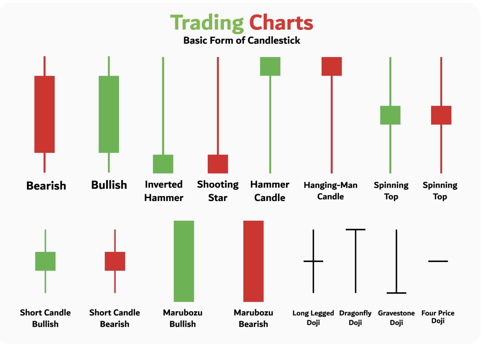

> This image is a **shape catalogue (aakriti ki pehchaan)**, not a buy/sell signal catalogue. The image contains 16 labelled examples; colour alone does not decide the trade.

### 1. Bullish candle (Tezi ki candle)
- **Shape:** Green body; close is above open (close open se upar).
- **What it says:** Buyers controlled that timeframe (buyers ki pakad thi).
- **Useful context:** Stronger when it closes above resistance or confirms support.
- **Do not assume:** One green candle is not an automatic buying signal.
- candle close near to its high.


### 2. Bearish candle (Mandi ki candle)
- **Shape:** Red body; close is below open (close open se neeche).
- **What it says:** Sellers controlled that timeframe (sellers ki pakad thi).
- **Useful context:** Stronger when it closes below support or confirms resistance.
- **Do not assume:** One red candle is not an automatic short signal.
- 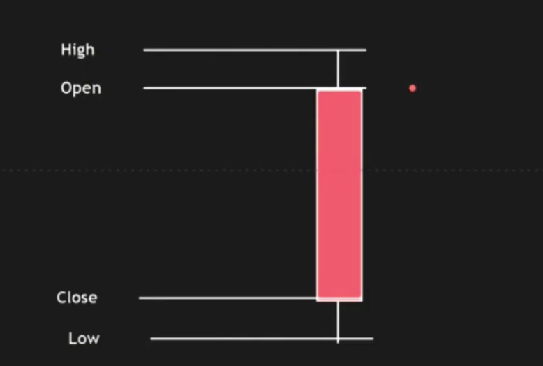

### 3. Hammer (Hammer candle)

- **Shape:** Small body near the top, long lower wick, and little/no upper wick.
- **What it says:** Price fell but buyers recovered it; lower prices were rejected (neeche ke price reject hue).
- **Useful context:** Only meaningful **after a downtrend**, near support.
- **Trade caution:** Wait for a bullish candle to close above the hammer high; a hammer anywhere on the chart is not bullish.

### 4. Hanging man (Hanging man candle)

- **Shape:** Same geometry as a hammer: small body near top and long lower wick.
- **What it says:** Sellers pushed price down during the period, but buyers only partly recovered it; weakness may be starting.
- **Useful context:** Only meaningful **after an uptrend**, near resistance.
- **Trade caution:** Wait for a bearish candle to close below the hanging-man low; never short from the shape alone.

### 5. Inverted hammer (Ulta hammer)

- **Shape:** Small body near the bottom with a long upper wick.
- **What it says:** Buyers tested higher prices; demand may be returning.
- **Useful context:** Only meaningful **after a downtrend**, near support.
- **Trade caution:** It needs bullish confirmation; without it, it can be only a pause.

### 6. Shooting star (Shooting star candle)
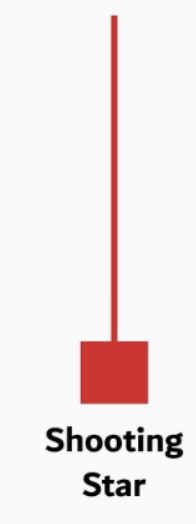
- **Shape:** Same geometry as an inverted hammer: small body near bottom and long upper wick.
- **What it says:** Higher prices were rejected (upar ke price reject hue); supply may be appearing.
- **Useful context:** Only meaningful **after an uptrend**, near resistance.
- **Trade caution:** Wait for a bearish close below its low; this shape during a downtrend is not automatically bearish.

### 7. Bullish spinning top (Bullish spinning top)
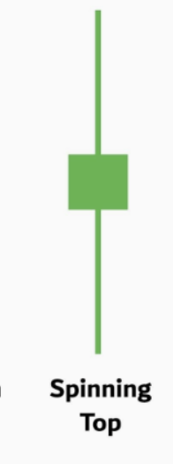
- **Shape:** Small green body with upper and lower wicks.
- **What it says:** Indecision (anischitata); the close is slightly bullish but conviction is weak.
- **Useful context:** At a key support/resistance level, then observe the next candle.
- **Do not assume:** It is not strong bullish momentum.
green but not strong bullish candle formation
- candle close is far from high and green body is small.
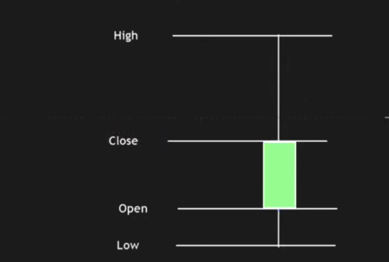

### 8. Bearish spinning top (Bearish spinning top)
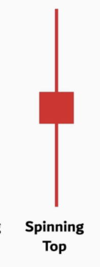
- **Shape:** Small red body with upper and lower wicks.
- **What it says:** Indecision; the close is slightly bearish but conviction is weak.
- **Useful context:** At a key support/resistance level, then observe the next candle.
- **Do not assume:** It is not strong bearish momentum.
- Red but not strong bearish candle formation
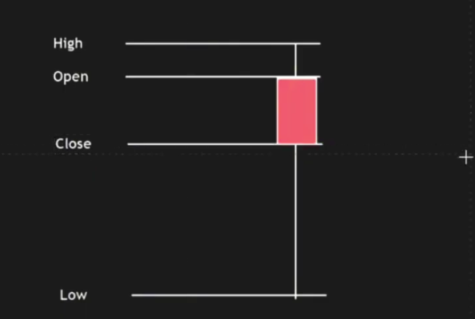

### 9. Short bullish candle (Chhoti bullish candle)
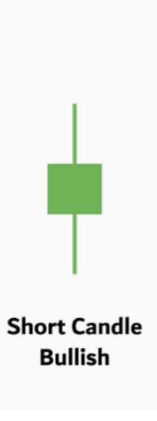
- **Shape:** Small green body with a limited price range.
- **What it says:** Mild buying with limited conviction.
- **Useful context:** Use only when market structure and volume support the idea.
- **Do not assume:** It confirms a breakout by itself.

### 10. Short bearish candle (Chhoti bearish candle)

- **Shape:** Small red body with a limited price range.
- **What it says:** Mild selling with limited conviction.
- **Useful context:** Use only when market structure and volume support the idea.
- **Do not assume:** It confirms a breakdown by itself.

### 11. Bullish marubozu (Bullish marubozu)

- **Shape:** Long green body with tiny or no wicks.
- **What it says:** Buyers controlled nearly the whole period (lagatar buying).
- **Useful context:** A valid breakout or support retest with relative volume.
- **Trade caution:** Do not chase a large marubozu into nearby resistance; calculate stop and reward first.

### 12. Bearish marubozu (Bearish marubozu)
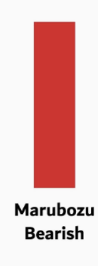
- **Shape:** Long red body with tiny or no wicks.
- **What it says:** Sellers controlled nearly the whole period (lagatar selling).
- **Useful context:** A valid breakdown or resistance rejection with relative volume.
- **Trade caution:** Do not short a large marubozu directly into nearby support.

### 13. Long-legged doji (Long-legged doji)
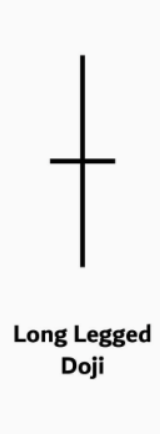
- **Shape:** Open and close are almost equal, with long wicks on both sides.
- **What it says:** Strong tug-of-war (buyers aur sellers ki takkar); high uncertainty.
- **Useful context:** At a trend extreme, then wait for a directional confirmation close.
- **Do not assume:** A doji itself is a reversal signal.

### 14. Dragonfly doji (Dragonfly doji)
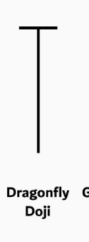
- **Shape:** Open and close near the high, with a long lower wick.
- **What it says:** Lower prices were rejected (neeche ke price ka rejection).
- **Useful context:** After a decline at support, with a bullish confirmation candle.
- **Do not assume:** It is bullish in the middle of a range.

### 15. Gravestone doji (Gravestone doji)
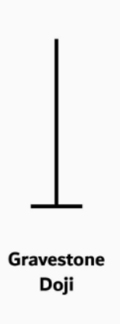
- **Shape:** Open and close near the low, with a long upper wick.
- **What it says:** Higher prices were rejected (upar ke price ka rejection).
- **Useful context:** After a rise at resistance, with a bearish confirmation candle.
- **Do not assume:** It is bearish in the middle of a range.

### 16. Four-price doji (Four-price doji)

- **Shape:** Open, high, low, and close are nearly identical.
- **What it says:** No meaningful auction or movement.
- **Useful context:** Usually illiquid, halted, or very low-activity data.
- **Trade caution:** Avoid treating it as a trade setup.

## How to read a formation (Formation ko kaise padhein)

Use this order; do not start with the candle name:

1. **Trend (rukh):** Is the higher timeframe making higher highs/higher lows, or lower highs/lower lows?
2. **Location (jagah):** Is the candle at a marked support, resistance, swing level, breakout, or retest? A pattern in the middle of a range has low value.
3. **Volume (volume):** Relative volume should support the move. A large candle on weak volume can fail.
4. **Confirmation (pushti):** Wait for the next candle to close in the expected direction, or take a planned retest entry.
5. **Trade math (hisab):** Define entry, stop, target, and position size before placing an order.

## Visual guide (Chitra se samjhein)

### Bullish and bearish bodies

```text
Bullish (tezi)                  Bearish (mandi)
    High                            High
     │                               │
   ┌───┐  Close                    ┌───┐  Open
   │   │                           │   │
   └───┘  Open                     └───┘  Close
     │                               │
    Low                             Low
```

### One shape, different meaning: hammer and hanging man

```text
Downtrend → support                 Uptrend → resistance
      \                                   /
       \  Hammer                         /  Hanging man
        \   ┌─┐                         /    ┌─┐
            │ │                              │ │
            │ │                              │ │
            │ │                              │ │
            └─┘                              └─┘
             │                                │
             │ long lower wick                │ long lower wick

Bullish close above hammer high       Bearish close below hanging-man low
= possible reversal                   = possible reversal
```

### One shape, different meaning: inverted hammer and shooting star

```text
Downtrend → support                 Uptrend → resistance
      \                                   /
       \  Inverted hammer                /  Shooting star
        \       │                        /        │
                │ long upper wick                 │ long upper wick
               ┌─┐                               ┌─┐
               │ │                               │ │
               └─┘                               └─┘

Bullish confirmation required         Bearish confirmation required
```

### Indecision and momentum candles

```text
Spinning top (indecision)       Marubozu (strong control)
        │                         ┌─────┐     ┌─────┐
      ┌─┴─┐                       │     │     │     │
      └─┬─┘                       │     │     │     │
        │                         └─────┘     └─────┘
  Small body + both wicks       Bullish        Bearish
  → wait for confirmation       little/no wick → momentum, not a chase signal
```

### Doji family

```text
Long-legged             Dragonfly              Gravestone            Four-price
    │                       ──                      │                    ──
 ───┼───                     │                       │
    │                       │                       ──
    │                       │
both sides              long lower wick        long upper wick       virtually no range
indecision              support rejection      resistance rejection  avoid: likely illiquid
```

## Trading significance (Trading mein mahatva)

Candles show **who won one battle**, not who will win the next battle. Their usefulness rises when they appear at an important price location and are confirmed.

### Valid reversal sequence

```text
1. Existing trend        2. Key level          3. Rejection candle       4. Confirmation

Downtrend ↓              Support ─────         Hammer / dragonfly        Close above high
Uptrend   ↑              Resistance ───        Star / gravestone         Close below low

Only then: calculate entry, stop, target, and size.
```

- A wick crossing support/resistance but closing back inside can show rejection (rejection), but it is **not** a trade until confirmation.
- A marubozu can show momentum, but entering late after a large candle creates poor risk-to-reward (risk ke mukable munafa kam).
- A doji/spinning top usually means **wait**, not “buy and sell both”.
- If higher-timeframe structure disagrees with the candle, give more weight to the higher timeframe.

## Pre-trade checklist (Trade se pehle jaanchen)

### Chart setup

- [ ] **Trend:** Have I checked the next higher timeframe?
- [ ] **Location:** Is the formation at support, resistance, a breakout, or a retest—not in the middle of a range?
- [ ] **Formation:** Does the candle name match its actual context? Example: hammer after decline, hanging man after rise.
- [ ] **Volume:** Does relative volume support the rejection or breakout?
- [ ] **Confirmation:** Has the next candle closed beyond the formation high/low, or is a retest entry planned?

### Risk and execution

- [ ] **Entry:** Enter only after confirmation close or planned retest; do not enter while the candle is still forming.
- [ ] **Stop-loss:** Place the stop beyond the formation extreme (wick high/low); never widen it after entry.
- [ ] **Target:** Identify the next structure level and take the trade only if potential reward is at least **2×** the risk (minimum 1:2).
- [ ] **Size:** Calculate quantity so this stop-loss stays within both your per-trade and daily maximum loss.
- [ ] **No trade:** Skip if there is major event risk, no confirmation, a wide stop, poor reward-to-risk, conflicting higher timeframe, or unclear structure.

### If trading options (F&O)

- [ ] **Underlying first:** Decide bullish/bearish/sideways from the underlying chart; do not use the option premium chart alone for direction.
- [ ] **Contract quality:** Check expiry, strike liquidity, bid-ask spread, and available margin before entering.
- [ ] **Volatility and time:** Check IV/IVP and theta. A correct directional view can still lose money if IV falls or theta decay is high.
- [ ] **Defined risk:** For option buying, respect premium-at-risk and time stop; for option selling, use defined-risk hedges and a mandatory stop-loss.

> **Final rule (aakhri niyam):** If you cannot clearly write the reason for entry, stop, target, and invalidation before clicking buy/sell, the correct trade is **no trade**.
