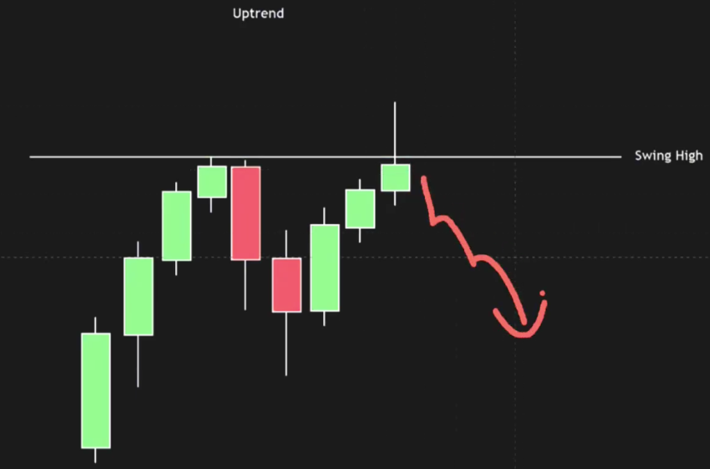
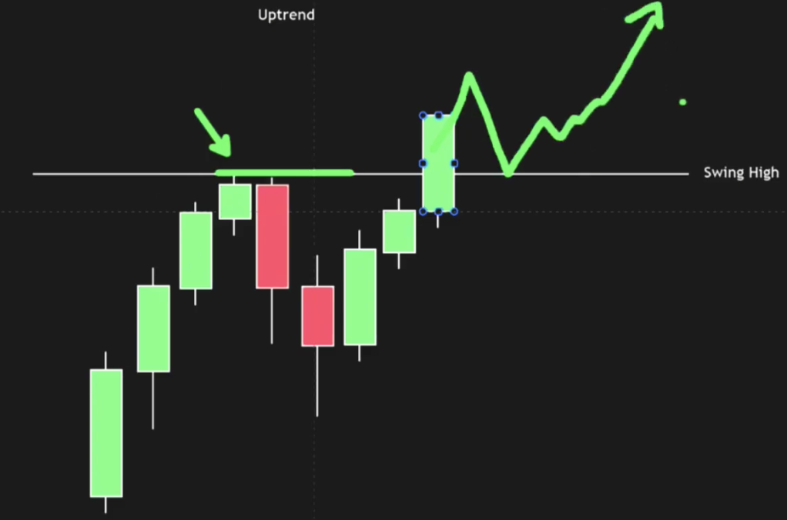
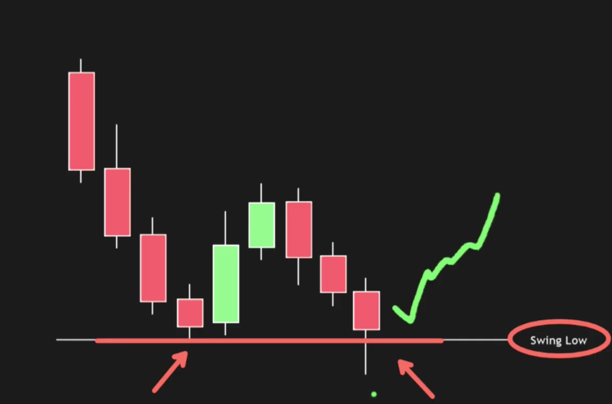

# Capturing 

## Uptrends 

## Swing High line

- there is a line, which buyers not able to break. at that level sellers gets activated and they push back the price.
- As it is not able to cross swing high line, there is a petential reversal as seller has been activated there.
- Notice wick is crossing the swing high line line but candle closed below swing high line.



- It is a breakout point


### higher highs and higher lows
- **Higher Highs:** Every time the price jumps up to a new peak (a "high"), that peak is taller than the last one.
- **Higher Lows:** Every time the price dips back down (a "low"), it doesn't fall as far down as the previous dip.

```text
                                            Peak 3 (Highest High)
                                                    /\
                                                   /  \
                                                  /    \
                    Peak 2 (Higher High)         /      \ Dip 3 (Higher Low)
                          / \                   /
                        /    \                 /
                      /       \               /
                    /          \ Dip 2 (Higher Low)
                  /
Peak 1 (High)    /
  /\            /
 /  \          /
/    \ Dip 1 (Low)
```

## Downtrends

## Swing low line

- here buyers get activated and do not want price to go down below swing low line

### lower highs and lower lows,
- **Lower Highs:** Every time the price bounces back up to a peak (a "high"), it fails to reach the height of the previous bounce.
- **Lower Lows:** Every time the price drops (a "low"), it falls even deeper than the previous drop.

```text
Peak 1 (High)
  /\
 /  \
/    \ 
      \ Dip 1 (Low)
       /\
      /  \ Peak 2 (Lower High)
     /    \
           \
            \ Dip 2 (Lower Low)
             /\
            /  \ Peak 3 (Lower High)
           /    \
                 \
                  \ Dip 3 (Lower Low)
```