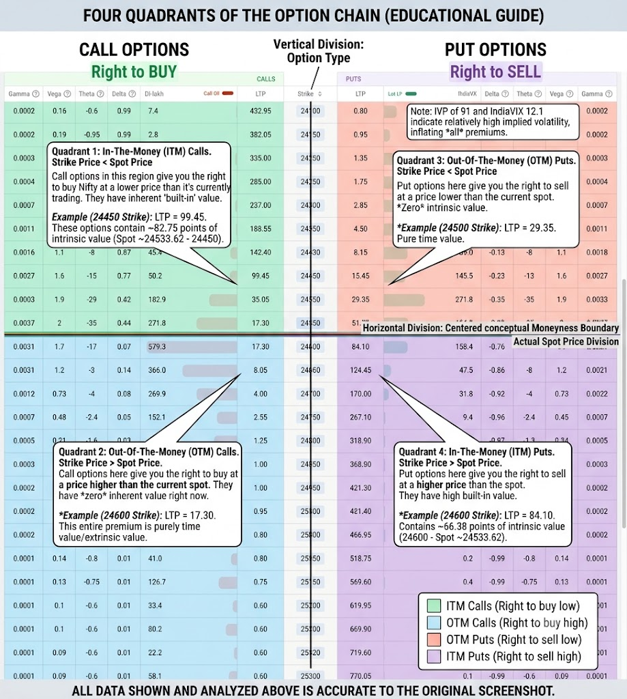

Based on the [Sensibull Option Chain](https://web.sensibull.com/option-chain?tradingsymbol=NIFTY&expiry=2026-07-21&view=all) you are viewing, here is a detailed breakdown of all the columns, what they mean, and how you can use them in real-world trading.

For acronyms and term definitions, see [trading_jargon_acronyms.md](./trading_jargon_acronyms.md).

To make it easier to digest, I have grouped the columns into four main categories: **Price & Value**, **Liquidity & Market Sentiment**, **Probability & Risk**, and **Option Greeks**.

---

## Table of Contents

| # | Section | Topics Covered |
|---|---------|----------------|
| 0 | [How to Read the Option Chain Layout](#0-how-to-read-the-option-chain-layout) | Call side, Put side, spot/ATM boundary, ITM and OTM quadrants |
| 1 | [Price & Value Columns](#1-price--value-columns) | Strike, LTP, Bid/Offer, Intrinsic Value, Time Value |
| 2 | [Liquidity & Market Sentiment](#2-liquidity--market-sentiment) | Volume, Open Interest, OI Change, PCR, IV |
| 3 | [Probability & Risk](#3-probability--risk) | Breakeven, POP |
| 4 | [Option Greeks](#4-option-greeks) | Delta, Theta, Vega, Gamma |
| 5 | [Top 3 Columns for Risk-Screened Candidates](#5-top-3-columns-for-risk-screened-candidates) | Delta and POP, OI & OI Chg, IV/IVP — inputs for evaluating a defined-risk candidate |
| 6 | [Live Market Monitoring — Derivatives Context](#6-live-market-monitoring--derivatives-context) | Intraday OI change, OI concentrations, and conditional squeeze/unwind signals |
| 7 | [Pre-Trade Go/No-Go Checklist — Session Learnings](#7-pre-trade-gono-go-checklist--session-learnings) | Theta trap pattern, GIFT Nifty caveats, VIX direction, when to sit out |

> **Terms & acronyms:** See [trading_jargon_acronyms.md](./trading_jargon_acronyms.md) for full definitions.

### Quick Index — Column by Column

| Column / Term | Category | Jump To |
|---------------|----------|---------|
| Call side vs Put side | Option Chain Layout | [§0](#0-how-to-read-the-option-chain-layout) |
| Spot / ATM boundary | Option Chain Layout | [§0](#0-how-to-read-the-option-chain-layout) |
| ITM and OTM quadrants | Option Chain Layout | [§0](#0-how-to-read-the-option-chain-layout) |
| Strike | Price & Value | [§1](#1-price--value-columns) |
| LTP, LTP Chg, LTP (chg%) | Price & Value | [§1](#1-price--value-columns) |
| Bid & Offer (Ask) | Price & Value | [§1](#1-price--value-columns) |
| Int Val S (Spot) & Int Val F (Future) | Price & Value | [§1](#1-price--value-columns) |
| Time Value | Price & Value | [§1](#1-price--value-columns) |
| Volume | Liquidity & Sentiment | [§2](#2-liquidity--market-sentiment) |
| OI-lakh (Open Interest) | Liquidity & Sentiment | [§2](#2-liquidity--market-sentiment) |
| OI Chg & OI Chg% | Liquidity & Sentiment | [§2](#2-liquidity--market-sentiment) |
| PCR (Put-Call Ratio) | Liquidity & Sentiment | [§2](#2-liquidity--market-sentiment) |
| IV (Implied Volatility) | Liquidity & Sentiment | [§2](#2-liquidity--market-sentiment) |
| Breakeven (%) | Probability & Risk | [§3](#3-probability--risk) |
| POP (Probability of Profit) | Probability & Risk | [§3](#3-probability--risk) |
| Delta | Option Greeks | [§4](#4-option-greeks) |
| Theta | Option Greeks | [§4](#4-option-greeks) |
| Vega | Option Greeks | [§4](#4-option-greeks) |
| Gamma | Option Greeks | [§4](#4-option-greeks) |
| **Delta and POP** ⭐ | **Risk-Screening Inputs** | [§5](#5-top-3-columns-for-risk-screened-candidates) |
| **OI & OI Chg** ⭐ | **Risk-Screening Inputs** | [§5](#5-top-3-columns-for-risk-screened-candidates) |
| **IV / IVP** ⭐ | **Risk-Screening Inputs** | [§5](#5-top-3-columns-for-risk-screened-candidates) |
| Intraday OI Change | Live Monitoring | [§6](#6-live-market-monitoring--derivatives-context) |
| OI vs Strike Chart | Live Monitoring | [§6](#6-live-market-monitoring--derivatives-context) |
| Multi-Strike OI Chart | Live Monitoring | [§6](#6-live-market-monitoring--derivatives-context) |
| Intraday PCR Slope | Live Monitoring | [§6](#6-live-market-monitoring--derivatives-context) |
| GIFT Nifty Caveat | Pre-Trade Filter | [§7](#7-pre-trade-gono-go-checklist--session-learnings) |
| Theta Trap Pattern | Pre-Trade Filter | [§7](#7-pre-trade-gono-go-checklist--session-learnings) |
| VIX Direction Filter | Pre-Trade Filter | [§7](#7-pre-trade-gono-go-checklist--session-learnings) |
| FII Futures Divergence | Pre-Trade Filter | [§7](#7-pre-trade-gono-go-checklist--session-learnings) |
| Pre-Trade Go/No-Go Checklist | Pre-Trade Filter | [§7](#7-pre-trade-gono-go-checklist--session-learnings) |

---

### 0. How to Read the Option Chain Layout

Before analysing premiums, OI, IV, or Greeks, first understand how the option chain is arranged.



> **Important:** Background colors are platform-specific. Do not decide whether an option is ITM or OTM from color alone. Always compare the **strike price** with the current **spot price**.

#### The Basic Layout: Calls, Puts, and the Spot Price

The option chain has two main dividing lines:

- **Vertical division — option type:** The center column contains the **strike prices**. **Call Options (CE)** are displayed on the left, while **Put Options (PE)** are displayed on the right.
- **Horizontal division — moneyness boundary:** The current spot price lies between two nearby strikes. The strike nearest to spot is generally treated as **At-The-Money (ATM)**. Strikes above and below this area form the ITM and OTM regions.

For NIFTY 50, BANKNIFTY, and SENSEX index options, “right to buy” or “right to sell” describes the option's payoff logic. These European-style index options are cash-settled; no units of the index are physically delivered.

In the image, the annotation uses a spot price of approximately `24,533.62`. Therefore, the practical ATM boundary lies around the nearest available strikes. Spot changes continuously, so the ITM/OTM boundary also moves during the session.

#### The Colors: A Visual Moneyness Guide

Platforms often use different shades to separate moneyness:

- **ITM region:** The option has intrinsic value because its strike is favorable relative to spot.
- **OTM region:** The option has zero intrinsic value. Its premium consists entirely of extrinsic/time value.
- **ATM region:** The strike is closest to spot. ATM options normally contain mostly extrinsic value and are highly sensitive to changes in spot, time, and IV.

Use these formulas instead of relying on color:

```text
Call intrinsic value = max(Spot - Strike, 0)
Put intrinsic value  = max(Strike - Spot, 0)
Extrinsic value      = Option premium - Intrinsic value
```

#### The Four Quadrants

Combining option type with moneyness produces four conceptual quadrants.

##### Quadrant 1 — Top Left: ITM Calls

- **Condition:** `Call strike < Spot`
- **Buyer meaning:** The CE gives its buyer the right to buy the index at a strike below its current spot value.
- **Value:** It contains intrinsic value plus any remaining extrinsic value.
- **Typical behavior:** ITM Calls are normally more expensive and have a higher positive long-option Delta, moving more closely with the underlying than OTM Calls.
- **Seller meaning:** A short ITM CE already has intrinsic-value exposure. If spot rises further, the seller's loss can increase rapidly.

Example using spot `24,533.62`:

```text
24,450 CE intrinsic value = 24,533.62 - 24,450 = 83.62 points
```

##### Quadrant 2 — Bottom Left: OTM Calls

- **Condition:** `Call strike > Spot`
- **Buyer meaning:** The CE gives its buyer the right to buy above the current spot price, so immediate exercise would have no value.
- **Value:** It has zero intrinsic value; its entire premium is extrinsic/time value.
- **Typical behavior:** OTM Calls are usually cheaper than comparable ITM Calls and need spot to rise sufficiently before expiry to gain intrinsic value.
- **Seller meaning:** The seller benefits if the Call's extrinsic value decays, but the position still carries upside gap and short-Gamma risk. A low premium does not make the short Call safe.

##### Quadrant 3 — Top Right: OTM Puts

- **Condition:** `Put strike < Spot`
- **Buyer meaning:** The PE gives its buyer the right to sell below the current spot price, so immediate exercise would have no value.
- **Value:** It has zero intrinsic value; its entire premium is extrinsic/time value.
- **Typical behavior:** OTM Puts are usually cheaper than comparable ITM Puts and gain intrinsic value only if spot falls below the strike.
- **Seller meaning:** The seller benefits if the Put remains OTM and its extrinsic value decays, but a sharp decline can rapidly increase Delta, Gamma, IV, and the seller's loss.

##### Quadrant 4 — Bottom Right: ITM Puts

- **Condition:** `Put strike > Spot`
- **Buyer meaning:** The PE gives its buyer the right to sell the index at a strike above its current spot value.
- **Value:** It contains intrinsic value plus any remaining extrinsic value.
- **Typical behavior:** ITM Puts are normally more expensive and have a long-option Delta closer to `-1`, so their premiums move more closely—in the opposite direction—with the underlying.
- **Seller meaning:** A short ITM PE already has intrinsic-value exposure. If spot falls further, the seller's loss can increase rapidly.

Example using spot `24,533.62`:

```text
24,600 PE intrinsic value = 24,600 - 24,533.62 = 66.38 points
```

#### Quick Moneyness Rules

| Option | ITM | ATM | OTM |
|---|---|---|---|
| **Call (CE)** | Strike below spot | Strike nearest spot | Strike above spot |
| **Put (PE)** | Strike above spot | Strike nearest spot | Strike below spot |

> **Option-seller takeaway:** OTM does not mean risk-free, and ITM does not mean the position must be held until expiry. Use moneyness only as the first map of the chain; then evaluate Delta, Theta, Vega, Gamma, IV, liquidity, OI context, maximum loss, and the mandatory exit plan.

---

### 1. Price & Value Columns

These columns tell you exactly what you are paying for an option and what its true "value" is right now.

* **Strike:** The specific price of the underlying asset (NIFTY) at which the option contract can be exercised.
* *Trading Significance:* This is your target. You choose the strike based on where you think the market is headed and how much risk you want to take.


* **LTP, LTP Chg, & LTP(chg%):** "Last Traded Price" is the current premium of the option. The "Chg" shows the absolute point change, and "(chg%)" shows the percentage change from the previous day's close.
* *Trading Significance:* It tells you the exact cost to buy or the premium you receive to sell an option. The change percentage helps you gauge immediate momentum.


* **Bid & Offer:** The **Bid** is the highest price a buyer is willing to pay. The **Offer** (or Ask) is the lowest price a seller is willing to accept.
* *Trading Significance:* The difference between the two is the "spread." A tight spread (e.g., Bid at 100, Offer at 100.5) means high liquidity, and you won't lose much money just entering and exiting the trade.


* **Int Val S (Spot) & Int Val F (Future):** Intrinsic Value. This is the real, built-in value of the option if it were to expire right this second. It is calculated based on either the Spot price (current cash price of NIFTY) or the Futures price.
* *Trading Significance:* Out-of-the-Money (OTM) options have zero intrinsic value. In-The-Money (ITM) options have intrinsic value. It helps you separate the real worth of the option from the "hope" (time value) priced into it.


* **Time Value:** The portion of the option's premium (LTP) that is purely based on the time left until expiry (Calculated as `LTP - Intrinsic Value`).
* *Trading Significance:* Option buyers *pay* time value and lose it as expiry approaches. Option sellers *collect* time value and want it to decay to zero.


### 2. Liquidity & Market Sentiment

These columns show trading activity and where open contracts are concentrated. They do not, by themselves, identify participant type, position side, intent, or future direction.

* **Volume:** The total number of contracts traded during the current day.
* *Trading Significance:* High volume confirms strong interest. You should only trade strikes with high volume to ensure you can enter and exit trades easily without price slippage.


* **OI-lakh (Open Interest):** The total number of active, open contracts that have not yet been settled or closed, displayed in lakhs. The **Call OI** and **Put OI** visual bars represent this graphically.
* *Trading Significance:* OI marks concentrations of open contracts. A concentration may become a support or resistance candidate, but OI alone cannot show whether buyers or sellers initiated it or whether the level will hold.
* **High Call OI:** A concentration of open Call contracts. Treat it as potential resistance only when OI change, Call-premium behavior, and spot action together support a call-writing interpretation.
* **High Put OI:** A concentration of open Put contracts. Treat it as potential support only when OI change, Put-premium behavior, and spot action together support a put-writing interpretation.


* **OI Chg & OI Chg%:** The absolute and percentage change in Open Interest for the day.
* *Trading Significance:* Shows where contracts are being added or removed, not which participant side or intent caused the change. Interpret it with spot and option-premium movement: rising Call OI may be consistent with fresh call writing only when the price evidence confirms short buildup; falling Put OI may be consistent with put-side unwinding only when the accompanying evidence confirms it.


* **PCR (Put-Call Ratio):** (Listed at the top of the chain for the whole expiry) Total Put OI divided by Total Call OI.
* *Trading Significance:* PCR is a contextual ratio, not a standalone bullish/bearish signal. A value above or below `1` only describes relative Put versus Call OI; it does not prove put writing, call writing, participant intent, or an overbought/oversold condition. Use its intraday change with strike-level OI change, option-premium behavior, and spot action.


* **IV (Implied Volatility):** The market's expectation of how much the underlying asset will move in the future.
* *Trading Significance:* IV affects option premiums but is not a standalone buy/sell rule. Assess a strike's IV relative to its history, the market-implied expected move, scheduled and unscheduled event/gap risk, skew, liquidity, and the complete strategy's net Vega. Elevated IV can reflect greater risk and is not automatically a reason to sell; low IV is not automatically a reason to buy.


### 3. Probability & Risk

These columns are crucial for calculating your statistical edge before taking a trade.

* **Breakeven(%):** The underlying-price boundary—or boundaries—for the **complete strategy** where gross expiry payoff changes between profit and loss. For a short option or credit strategy, current spot can already be inside the profit region; the breakeven generally marks the expiry level beyond which the position loses before charges.
* *Trading Significance:* Compare current spot and the expected move with every strategy breakeven, maximum loss, and invalidation level. Breakeven describes an expiry payoff boundary, not how far spot must move before a credit strategy can first become profitable, and charges shift the net-P&L boundary.


* **POP (Probability of Profit):** A model-estimated probability that the **complete strategy** finishes above its profit threshold at the selected evaluation time, commonly expiry. It depends on every leg, entry prices, strategy breakeven(s), IV, time, and model assumptions.
* *Trading Significance:* POP is a strategy-level estimate and is not interchangeable with Delta. Absolute Delta is a separate, rough single-leg proxy for expiry ITM risk. Do not calculate POP as `1 - |Delta|`; neither measure guarantees the realised win rate, and infrequent tail losses can outweigh frequent small gains.


### 4. Option Greeks

Greeks estimate how an option premium responds to changes in the underlying, time, and volatility. Option-chain Greeks generally describe a **one-unit long option**. A short position reverses the sign of each displayed Greek:

- A short CE has negative Delta; a short PE has positive Delta.
- Option sellers generally have positive position Theta, negative Vega, and negative Gamma.
- Greek values vary with spot, strike, IV, time, rates, and model assumptions.

Greeks are risk sensitivities, **not standalone trading signals**. Use them only with the five-view market classification, price invalidation levels, liquidity, OI/IV context, and a predefined risk plan.

For a small change around the current market state:

```text
Long-option premium change ≈
  Delta × spot-point change
  + ½ × Gamma × (spot-point change)²
  + Theta × elapsed calendar days
  + Vega × IV change in percentage points

Short-position change ≈ the negative of the long-option change
```

Here, premium and spot changes are measured in index points; Delta is premium points per one spot point; Gamma is the change in Delta per one spot point; Theta is premium points per elapsed calendar day; Vega is premium points per one percentage-point change in IV; and IV change means percentage points, not a relative percentage. This is a **local estimate**. For a large move, recalculate using current Greeks because Delta, Gamma, Theta, and Vega all change during the move.

#### Delta

Delta estimates the option-premium change for a one-point move in the underlying, with the other pricing inputs held approximately constant.

- A long CE Delta ranges from `0` to `+1`; a long PE Delta ranges from `-1` to `0`.
- Short-position Delta reverses the displayed long-option sign. Therefore, a short CE has negative Delta and a short PE has positive Delta.
- Absolute Delta is commonly used as a rough risk or probability proxy, but it is not an exact probability and never promises a win rate.
- Delta is dynamic. Gamma measures how Delta changes as spot moves; IV, skew, and time also affect how each leg evolves.

For a multi-leg strategy, add the **position Deltas** of all legs. Net Delta near zero means the position is approximately direction-neutral **only at that instant**. Gamma, IV, skew, and time prevent two legs from remaining perfectly offset after the market state changes.

**Risk exits must be chosen before entry and used together. Every trade requires a mandatory stop-loss, and the trading plan must define a daily max loss after which no new trades are taken:**

1. **Underlying invalidation:** the mandatory stop-loss must exit the trade when spot breaks the price level that invalidates the market view or strategy range.
2. **Strategy-value or per-trade rupee max loss:** the mandatory stop-loss must also enforce the predefined premium-value limit or maximum acceptable rupee loss, whichever triggers first.
3. **Delta threshold:** exit or adjust when the predefined position- or leg-Delta threshold is reached. `0.40` is not a universal stop; the threshold depends on the strategy, time to expiry, hedge, and risk budget.

Set the **daily max loss** before the session. If cumulative realised and open losses reach it, close or reduce risk according to the plan and take no new trades that day.

#### Hypothetical NIFTY short-PE example — 4-Aug-2026

This naked-leg example is retained only to teach Delta arithmetic; it is **not the preferred live structure or a live trade recommendation**. An actual trade should add a protective farther-OTM long PE to form a defined-risk bull put spread, then calculate the spread's maximum loss and place the mandatory stop-loss before entry.

- **NIFTY spot:** `22,000`
- **Position:** sell one `21,700 PE`
- **Hypothetical weekly expiry:** `11-Aug-2026` (Tuesday; verify the dated contract and its availability in the live NSE contract master before use)
- **Entry premium:** `50` points
- **Long-option Delta shown in chain:** `-0.20`
- **Seller position Delta:** `+0.20`
- **Current NIFTY lot size:** `65` (verify live contract master)

Ignoring Gamma, Theta, and Vega for the first-order Delta estimate:

- **Approximate 100-point fall:** The long PE premium rises by about `0.20 × 100 = 20` points, from `50` to `70`. If the position remains open, the seller's estimated gross current-M2M loss is `(70 - 50) × 65 = ₹1,300`; it becomes realised only when the position is closed or settled.
- **Approximate 100-point rise:** The long PE premium falls by about `0.20 × 100 = 20` points, from `50` to `30`. If the position remains open, the seller's estimated gross current-M2M gain is `(50 - 30) × 65 = ₹1,300`; it becomes realised only when the position is closed or settled.
- **Maximum gross profit:** A repurchase at zero produces a `50 × 65 = ₹3,250` gross realised profit; expiry worthless produces the same gross expiry payoff. Net P&L is lower after charges and slippage.
- Any repurchase below `50` can produce a gross profit. Charges and slippage reduce net profit.

These are local Delta-only estimates. Actual premium changes can differ because Delta changes with spot and because Gamma, Theta, Vega, IV skew, and market liquidity also affect the option price.

#### Theta

This Theta guide applies only to **NIFTY 50, BANKNIFTY, and SENSEX European-style, cash-settled index options**. It does not apply to individual-stock options.

Theta estimates how an option premium changes when one **calendar day** passes, assuming spot, IV, interest rates, and the other pricing inputs remain unchanged.

The option chain normally displays long-option Theta, which is usually negative. A short position reverses that sign, so the same contract normally gives its seller positive position Theta.

For example, displayed long-option `Theta = -12` estimates a `12`-point premium loss from one calendar day passing under the unchanged-input assumptions. It does **not** guarantee that the option will be ₹12 cheaper by the next market session. Spot, IV, Gamma, skew, liquidity, and market repricing can produce a very different observed change.

Theta is stated in premium points. Convert it to rupees only by multiplying the point change by the current lot quantity and number of lots.

**Dated NIFTY illustration — 4-Aug-2026:** Using the NIFTY lot quantity of `65` as of this date, a `12`-point decay for one lot would be `12 × 65 = ₹780` gross before charges, provided the estimate's assumptions actually held. Exchange contract specifications can change; verify the live NSE contract master before trading.

##### What decays, and how

```text
Option premium = intrinsic value + extrinsic (time) value
```

- Only extrinsic value decays toward expiry merely because time passes. Intrinsic value does not time-decay, although it changes when spot changes.
- An ITM option therefore retains its remaining intrinsic value if it stays ITM; its premium cannot decay below that intrinsic value.
- ATM options generally have the largest absolute Theta near expiry because their remaining value is predominantly time-sensitive and the expiry outcome is still uncertain.
- An OTM option's premium can approach zero as the probability of it expiring ITM collapses. Far-OTM options often have little absolute Theta because little premium remains, but their small premium does not remove gap or tail risk for the seller.
- Decay is non-linear. It generally accelerates as expiry approaches, especially around ATM; it is not a fixed amount earned each day.
- Weekends and holidays are calendar time. Their effect is incorporated through option-pricing conventions and through repricing before and after the closure, so “weekend Theta” is not guaranteed free profit. A spot gap or IV repricing can more than offset the expected decay.

##### When positive Theta still loses

Use the combined Greek approximation above rather than treating Theta as an isolated income line:

- If seller Theta contributes `+12` points but an adverse Delta/Gamma effect contributes `-35`, the estimated seller change is about `+12 - 35 = -23` premium points before Vega.
- If seller Theta contributes `+12` points but negative Vega exposure produces `-20` points of IV-driven seller P&L during IV expansion, the estimated seller change is about `+12 - 20 = -8` points before directional effects.
- A gap through a short strike can create a Delta/Gamma loss that overwhelms several days of collected decay before the seller can adjust.

Positive Theta is compensation for taking short-Gamma and short-Vega exposure, not an independent edge.

##### DTE and moneyness

- **Farther expiry:** daily decay is generally slower, Vega exposure is generally larger, and there is more time for the market view to fail.
- **Near expiry:** ATM decay is generally faster, but Gamma sensitivity is much higher and there is less time to adjust or exit.
- **Far OTM:** premium and absolute Theta are often smaller, while a severe gap or tail event can still move the option rapidly toward or into the money.
- **ITM:** time value can decay, but the premium cannot decay below the intrinsic value that remains while the option stays ITM.

Select days to expiry (DTE) from the expected duration of the five-view market thesis and the predefined risk budget—not simply by choosing the contract with the highest Theta. Higher near-expiry Theta commonly comes with higher Gamma risk and less adjustment time.

##### Evaluate net strategy Theta

For every structure, add the **position Greeks of all legs** and manage the resulting net Theta, Delta, Vega, and Gamma. Do not assess only the short leg.

- **Naked short option:** normally has positive Theta, but directional loss is undefined for a short CE and very large for a short PE. It is not the default structure.
- **Credit spread:** normally has positive net Theta because the short option's Theta exceeds the long hedge's negative Theta, while the hedge caps maximum loss.
- **Iron condor:** normally has positive net Theta while spot remains inside the planned range, with capped loss from its two protective wings.
- **Short straddle or strangle:** can have high positive net Theta, but also high short-Gamma and tail risk. It is therefore not the default beginner structure.

Net Greeks change as spot, IV, and time change. Recalculate the whole strategy rather than assuming the entry Theta will persist.

##### Theta entry and management checklist

**Before entry:**

1. Classify the market as **Strongly Bullish, Slightly Bullish, Sideways, Slightly Bearish, or Strongly Bearish**.
2. Check India VIX direction and the proposed strikes' IV/IVP.
3. Inspect PCR slope and intraday OI change.
4. Choose the strategy and DTE from the market view and risk budget.
5. Confirm liquidity and bid–ask spread for both the short and hedge legs.
6. Calculate net credit, maximum loss, breakeven, and net Delta, Theta, Vega, and Gamma.
7. Define the mandatory stop, profit-capture target, adjustment rule, time exit, per-trade max loss, and daily max loss.

**During the trade:**

1. Recheck spot relative to every short strike.
2. Monitor net Delta and Gamma acceleration as spot moves.
3. Monitor IV, net Vega exposure, and the resulting IV-driven P&L.
4. Exit when the predefined invalidation or risk limit is reached rather than waiting for Theta to rescue the position.

#### Vega

Long-option Vega estimates the premium-point change for a **one-percentage-point change in the option's implied volatility (IV)**, with spot, time, rates, and the other pricing inputs held approximately constant. For example, long-option `Vega = +8` estimates that an IV rise from `14%` to `15%` would add about `8` premium points. This is a local estimate, not a guarantee.

- Long CE and PE positions normally have positive Vega. Selling an option reverses the displayed sign, so option sellers normally have **negative position Vega**.
- An IV increase normally raises an option's premium. It can therefore make a short option lose value even after time has elapsed: an adverse Vega effect can exceed favorable Theta decay.
- An IV decrease normally lowers the premium. An **IV crush** helps a negative-Vega seller only if adverse spot, Delta, and Gamma effects do not dominate the volatility benefit.
- A strike's IV is the volatility input implied by that particular option's market price. **India VIX is not the same measurement**: it is an index derived from NIFTY option prices to represent the market's expected near-term volatility. Do not substitute the VIX level for a strike's IV or assume every strike will reprice by the same amount.
- “High IV” is not sufficient reason to sell. Compare each strike's IV with its own historical context, available IV rank/percentile, liquidity and bid–ask spread, volatility skew, scheduled and unscheduled event risk, and the expected move over the planned holding period.

For a multi-leg strategy, add every leg's **position Vega**. A long hedge normally offsets part of the short leg's negative Vega, but the net Vega and skew exposure change as spot, IV, and time change.

#### Gamma

Gamma is the change in Delta for a **one-point move in the underlying**, with the other pricing inputs held approximately constant. Long CE and long PE options normally have positive Gamma; short options reverse that sign and therefore have **negative position Gamma**.

- Gamma is generally greatest around ATM and increases sharply near expiry.
- A negative-Gamma seller's position Delta changes against the seller as spot moves: a short CE becomes increasingly short-Delta as spot rises, while a short PE becomes increasingly long-Delta as spot falls.
- Because Delta becomes more adverse during the move, short-Gamma losses can accelerate as spot approaches and crosses the short strike.
- High expiry-day Theta and high Gamma arrive together, especially near ATM. Faster potential decay is compensation for faster-changing directional risk, not free income.
- Net Gamma is the sum of all leg position Gammas. A protective long option adds positive Gamma and caps the structure's maximum loss, but it does not make the spread insensitive to fast spot moves.

> **Short-Gamma rule**
>
> Do not select a short option merely because Theta is high.  
> Check distance to the short strike, net Gamma, maximum loss, liquidity,  
> event/gap risk, and available adjustment time.

#### Indian index-option contract context — as of 4-Aug-2026

The examples in this section use the following dated contract context:

| Index | Exchange | Available expiries relevant here | Standard expiry day | Lot size |
|---|---|---|---|---:|
| NIFTY 50 | NSE | Weekly and monthly | Tuesday | 65 |
| BANKNIFTY | NSE | Monthly | Tuesday | 30 |
| SENSEX | BSE | Weekly and monthly | Thursday | 20 |

A holiday normally shifts expiry to the **previous trading day**. Exchange circulars can change expiry schedules and lot sizes, so verify the current contract master and applicable circular before placing a trade:

- [NSE equity-derivatives contract specifications](https://www.nseindia.com/static/products-services/equity-derivatives-contract-specifications)
- [NSE lot-size circular FAOP70616](https://nsearchives.nseindia.com/content/circulars/FAOP70616.pdf)
- [BSE index-derivatives contract specifications](https://beta.bseindia.com/static/markets/Derivatives/DeriReports/contractindex.aspx)
- [BSE expiry notice 20250623-59](https://www.bseindia.com/markets/MarketInfo/DispNewNoticesCirculars.aspx?page=20250623-59)

#### Three hypothetical seller examples — 4-Aug-2026

These examples are arithmetic illustrations, not live recommendations. Premiums and Greeks are hypothetical, quantities use the dated table above, and all gross figures exclude charges and slippage.

**P&L labels used in these examples:**

- **Current M2M:** the unrealised change in the open strategy's value relative to entry, using current market prices. Greek calculations below are local estimates of possible M2M changes, not realised cash.
- **Realised P&L:** the P&L locked in only after all relevant legs are closed or settled.
- **Gross expiry payoff:** the strategy payoff at expiry before brokerage, taxes, fees, and slippage; the maximum-profit and maximum-loss figures below are gross expiry values.
- **Net P&L after charges:** realised P&L after brokerage, taxes, exchange/statutory fees, and execution slippage. It cannot be known from the gross examples alone.

##### Example A — NIFTY short PE

Extend the earlier one-lot `21,700 PE` example with displayed long-option `Theta = -6`. Selling it reverses the sign, so the seller's position Theta is `+6` points per calendar day.

- **Unchanged-input one-day estimate:** `6 × 65 = ₹390` estimated gross favorable current-M2M change if the position remains open; it is not realised P&L.
- Actual P&L will differ when spot, IV, or the Greeks change. The naked short leg remains unsuitable as a default live structure; a protective long PE is needed to define maximum loss.

##### Example B — BANKNIFTY bull put spread

Assume the same monthly expiry, sell the higher-strike PE at `120`, buy a PE `200` points lower at `70`, and use quantity `30`.

```text
Net credit = 120 - 70 = 50 points
Strike width = 200 points
Maximum gross expiry profit = 50 × 30 = ₹1,500
Maximum gross expiry loss = (200 - 50) × 30 = ₹4,500
Hypothetical displayed long-option Greeks:
  higher-strike PE to sell: Delta -0.35, Theta -10, Vega +18, Gamma +0.0018
  lower-strike PE to buy:  Delta -0.22, Theta -6,  Vega +14, Gamma +0.0012
Position Greeks after reversing the sold leg's signs:
  sold higher-strike PE: Delta +0.35, Theta +10, Vega -18, Gamma -0.0018
  bought lower-strike PE: Delta -0.22, Theta -6, Vega +14, Gamma +0.0012
Net strategy Greeks:
  Delta = +0.35 - 0.22 = +0.13
  Theta = +10 - 6 = +4 points/day
  Vega = -18 + 14 = -4 points per IV percentage-point change
  Gamma = -0.0018 + 0.0012 = -0.0006 Delta per BANKNIFTY point
Approximate unchanged-input gross current-M2M decay benefit = 4 × 30 = ₹120
```

The hypothetical net Greeks describe local **current-M2M sensitivity**, not realised or expiry P&L. The lower-strike long PE caps the gross expiry loss, but the spread can still lose before expiry as spot falls, Delta and Gamma change, or IV expands. Use the predefined underlying invalidation, mandatory strategy-value stop, per-trade max loss, and daily max loss. Net realised P&L will also deduct charges and slippage.

##### Example C — SENSEX iron condor

Assume same-expiry call and put credit spreads, each with a `500`-point wing, total net credit of `100` points, and quantity `20`.

```text
Total net credit = 100 points
Wing width = 500 points
Maximum gross expiry profit = 100 × 20 = ₹2,000
Maximum gross expiry loss = (500 - 100) × 20 = ₹8,000
Net position Theta = +8 points/day
Approximate unchanged-input gross current-M2M benefit = 8 × 20 = ₹160
```

Spot approaching either short strike increases directional and Gamma risk. IV expansion can also increase the condor's mark-to-market loss through its normally negative net Vega. The maximum gross loss assumes equal wing widths and excludes charges and slippage.

#### Practical seller workflow

> **Market view → event/IV check → strategy → expiry/DTE → strikes/Delta/OI → liquidity → net Greeks → max-loss and exit plan → monitoring**

Apply each stage to the complete position, including every hedge leg. Recalculate net Greeks and remaining maximum risk during monitoring because entry sensitivities do not remain fixed.

**Rule alignment for this seller-focused guide:** [§7](#7-pre-trade-gono-go-checklist--session-learnings) and §4 use the same strict entry filter. Automatic blockers reject the trade immediately; separately, **three or more distinct contextual warning signals mean do not enter a new seller position**.

**Volatility classification:** India VIX is broad market context; a rise in India VIX is not itself a counted seller warning until the proposed strikes' IV or the strategy's relevant IV exposure confirms expansion. Confirmed rising strike/strategy IV harms a normally negative-Vega seller position and counts as one contextual warning. Stable or falling India VIX is not automatically safe. Falling India VIX counts only as part of the fully confirmed §7 Theta-trap evidence bundle: adverse OI/PCR behavior aligned with option-premium and spot action. Count that bundle once.

> **AUTOMATIC REJECT — no entry**
>
> - No five-view classification.
> - Undefined maximum loss or missing mandatory stop-loss, per-trade max loss, or daily max loss.
> - An illiquid hedge leg or an untradeable bid–ask spread.
>
> Do not count an automatic blocker toward the three-warning threshold.
>
> **COUNTED CONTEXTUAL WARNINGS**
>
> - Confirmed rising IV at the proposed strikes or across the strategy's relevant IV exposure against negative net Vega. Rising India VIX alone remains context until this confirmation.
> - Actual-open/GIFT-Nifty mismatch confirmed by conflicting domestic price structure, market breadth, IV/VIX, and OI/premium evidence.
> - Falling India VIX only when the complete Theta-trap evidence bundle is confirmed by adverse OI/PCR, option-premium, and spot behavior.
> - An established FII regime that is adverse to the proposed setup, supported by at least three consecutive sessions and validated by Net Change, cumulative Net OI, and broader participant context.
> - Conflicting or adverse PCR/OI evidence confirmed by option-premium and spot behavior outside a bundle already counted.
>
> [§7's Pre-Trade Go/No-Go table](#7-pre-trade-gono-go-checklist--session-learnings) is the canonical operational checklist; §4 uses the same five warning categories. Three or more **distinct** contextual warnings mean **do not enter a new seller position**. Do not double-count one volatility/OI/PCR/premium/spot evidence bundle.

---

### 5. Top 3 Columns for Risk-Screened Candidates

> **Question:** Which three option-chain inputs are most useful when evaluating a quality, risk-screened premium-selling candidate?

Use these columns to compare candidates, not to certify safety. A quality candidate balances modelled probability, defined maximum loss, price/OI confirmation, liquidity, and compensation for volatility and event risk. Delta, POP, OI, and IV cannot make a trade risk-free.

Based on the [Sensibull Option Chain](https://web.sensibull.com/option-chain?tradingsymbol=NIFTY&expiry=2026-07-21&view=all), the **top 3 most important columns** for this are:

#### 1. Delta and POP — Separate Measures

Use **Delta** and **POP** separately; they answer different questions.

* **Why it's useful for risk screening:** Delta measures how much an option price changes relative to NIFTY. Absolute Delta is also used as a rough proxy for the modelled probability of expiring In-The-Money, but it is not an exact probability or a promised outcome.
* **How to use them:**
  * An absolute long-option **Delta between 0.15 and 0.20** can be one single-leg strike-risk screen; it remains only a rough expiry-ITM-risk proxy.
  * Evaluate displayed **strategy POP** separately from the complete payoff, entry credit/debit, breakeven(s), IV, time, and model assumptions. Never infer `POP = 1 - |Delta|`.
  * Neither measure gives the probability that NIFTY will never touch the strike, and neither guarantees that the seller keeps the premium.

#### 2. OI (Open Interest) & OI Chg

Delta gives you the model sensitivity; **Open Interest** shows where open contracts are concentrated. The option chain alone does not identify whether that OI belongs to institutions or retail participants, and every open contract has both a buyer and a seller.

* **Why it's useful:** A large OI concentration can mark a potential support or resistance zone, but it is not a solid wall; positions can unwind and price can cross the strike.
* **How to use it:** Combine OI and OI change with Delta, price action, premium movement, and liquidity. For example, the highest Put OI strike below spot may be a support candidate for a Put-selling setup, but it still requires a defined maximum loss and invalidation level.

#### 3. IV (Implied Volatility) & IVP (Implied Volatility Percentile)

After Delta and OI help identify a risk-screened strike candidate, **IV** helps assess whether the premium compensates for the expected move and volatility risks.

* **Why it's crucial for good premium:** IV measures fear and uncertainty. When IV is high, option premiums swell; when IV is low, premiums shrink.
* **How to use it:** Compare IV with its historical context and check **IVP** at the top of the Sensibull screen (e.g. IVP at 62 means current IV is higher than 62% of readings over the lookback period). Elevated IV can provide richer premium, but it often reflects a larger expected move, event uncertainty, gap risk, or skew; it is not the same structural risk and is not free edge. An [IV Crush](./trading_jargon_acronyms.md#volatility--sentiment) helps a negative-Vega seller only if adverse spot and Gamma effects do not dominate.

#### Summary Checklist for a Risk-Screened Candidate

| Step | Column | What to Look For |
|------|--------|------------------|
| 1 | **IV / IVP** | Relative to history and assessed with expected move, events/gaps, skew, liquidity, and net strategy Vega |
| 2 | **Delta and POP** | Review separately: absolute Delta as a rough single-leg expiry-risk proxy; strategy POP from the full payoff and breakeven model—never `POP = 1 - |Delta|` |
| 3 | **OI & OI Chg** | Large OI concentration may mark potential support for puts or resistance for calls; confirm with OI change and price action |

---

### 6. Live Market Monitoring — Derivatives Context

> **Core idea:** Supplement static indicators (moving averages, RSI) with **real-time derivatives positioning**. Option writing requires margin, but aggressive OI change is not proof of institutional activity: the public chain aggregates participant types and does not identify who owns each position.

During market hours, keep the [Sensibull Live Option Chain](https://web.sensibull.com/option-chain?view=greeks) open. Focus on **OI-lakh** and **OI Chg** on both CE and PE sides as spot moves.

#### 1. Intraday OI Change (Not EOD OI)

Total OI shows where historical concentrations sit. **Intraday OI Change** (refreshed every ~5 minutes) shows where positions are changing *right now*.

* **What to watch:** Strikes where OI is expanding or shedding rapidly within a 15-minute window.
* **Example — Possible Short Buildup:** Market falling + Call OI expanding fast at ATM can be consistent with fresh call writing, but confirm with option-price movement and price action; the chain alone cannot identify the participant type.
* **Tool:** [Sensibull Multi-Strike OI Chart](https://web.sensibull.com/open-interest/multistrike-oi?tradingsymbol=NIFTY) — plot 3 CE and 3 PE strikes around spot on a time-series line.

#### 2. OI Concentrations at Specific Strikes

Option writers require margin, but tall OI bars show **position concentration**, not participant identity or guaranteed conviction.

| Signal | What It Means | Read As |
|--------|---------------|---------|
| **Possible Call Writing (CE)** | Call OI rises while option-price and spot behavior confirm short buildup | Potential **resistance**, not an unbreakable level |
| **Possible Put Writing (PE)** | Put OI rises while option-price and spot behavior confirm short buildup | Potential **support**, not an unbreakable floor |

* **Tools:** [OI vs Strike Chart](https://web.sensibull.com/open-interest/oi-vs-strike?tradingsymbol=NIFTY) for tallest bars; live option chain for strike-by-strike detail.

#### 3. Potential Intraday Setups

Potential intraday moves can develop when participants unwind or add positions:

| Setup | What to Watch | What It Signals |
|-------|---------------|-----------------|
| **Possible Put-Side Unwind** | Spot breaks a support candidate, Put OI falls, and Put premium/spot behavior confirms downside pressure | Consistent with weakening put-side support; participant identity and the next move remain unproven |
| **Multi-Strike OI Crossover** | CE OI rises relative to PE OI near spot, with Call premium and spot behavior confirming short buildup | Potential call-side resistance; not proof that bears control the zone |
| **Intraday PCR Slope** | PCR slopes down while strike OI, option premiums, and spot behavior confirm call-side short buildup | Possible call-writing pressure and weakness; PCR slope alone is insufficient |

> **Practical workflow:** (1) Identify the largest CE/PE OI concentrations from OI vs Strike. (2) Track intraday OI change on those strikes every 5 minutes. (3) Compare the OI change with spot and the relevant option-premium movement when price approaches or breaks a level. (4) Use PCR slope only as supporting context; infer writing or unwinding only when the evidence aligns.

---

### 7. Pre-Trade Go/No-Go Checklist — Session Learnings

> These filters come from live trading sessions where pre-market analysis looked solid but the market behaved differently. They catch the edge cases that theoretical frameworks miss.

---

#### Filter 1: Never Over-Weight GIFT Nifty Alone

**The trap:** GIFT Nifty showed a 100–115 pt gap-down. Actual open was only 22 pts down. A large pre-market signal does not guarantee a large actual gap.

**Rule:** Treat GIFT Nifty as a pre-market context indicator, not a guaranteed direction or magnitude forecast. Before deciding how aggressively to trade the gap, wait for the actual open and the first 5-minute candle to confirm the scale of the move. Cross-check current GIFT Nifty, major global index futures, and the dollar-index trend; when cues conflict, reduce conviction rather than applying a fixed discount.

---

#### Filter 2: Treat PDL and PDH as Reference Zones

**The observation:** On 21 July 2026, the PDL was 24,135.85 and the intraday low was 24,135.65—a difference of 0.20 points—before price moved away. This single observation does not establish that prior-day levels are exact on other sessions.

**Rule:** Treat PDH and PDL as prior-day **reference zones**, not guaranteed hard lines. Require price-action confirmation such as rejection, acceptance, or a close through the area. Choose any buffer from current volatility, liquidity, instrument behavior, and strategy risk rather than a fixed number, and define the invalidation and stop before entry.

---

#### Filter 3: Separate India VIX Context from Strike IV

**The trap:** VIX was at 13 (calm zone). Expectation was that it would spike on a gap-down and validate bearish momentum. Instead VIX fell further to 12.6.

**Rule:** Use India VIX as broad volatility context and confirm the actual proposed strikes' IV and net strategy Vega:

| Volatility observation | Interpretation | Seller action |
|---------------|-------------|------------|
| **India VIX rising** | Broad volatility context; strike IV may or may not confirm | Do not count it alone. If proposed-strike or strategy IV is also rising, count one short-Vega warning |
| **India VIX stable/falling** | Not automatically a safe seller environment | Apply all normal strike-IV, event, liquidity, Gamma, and risk checks |
| **India VIX falling with the full Theta-trap bundle** | Adverse OI/PCR aligned with option-premium and spot confirmation | Count the complete bundle once; do not count VIX, OI, and PCR separately |

---

#### Filter 4: Recognise the "Theta Trap" Session Before Entering

A **Theta Trap** describes a range-bound session in which time decay and muted volatility hurt premium buyers on both sides; the option chain does not prove that any participant deliberately engineered it.

**Signature — watch for all three together:**
1. VIX is low (≤ 14) **and falling** intraday
2. Call OI is rapidly building at ATM or just OTM; treat writing as unconfirmed without Call-premium and spot evidence
3. Put OI is falling rather than building; treat put-side unwinding as unconfirmed without Put-premium and spot evidence

**What it means:** The combination can be consistent with call-side resistance and sufficient put-side support for a range-bound market, but it does not identify who holds the positions or guarantee that either level will hold. If the market chops sideways, Theta and subdued IV can hurt CE and PE buyers even when spot moves slightly in their favour.

**Rule:** These observations do not, by themselves, authorize either a directional buy or a seller entry. Count the fully confirmed Theta-trap evidence bundle as one contextual warning. If that bundle plus other distinct warnings brings the total to three or more, **take no new seller position and sit out**. If fewer than three distinct warnings remain after avoiding double-counting and a seller setup independently passes every entry check, use only a defined-risk educational structure such as a hedged iron condor or credit spread—never a naked short strangle. Before entry, define the mandatory stop-loss, per-trade max loss, and daily max loss.

> *From 21-Jul-2026: PCR declined numerically from 1.2 to 0.81 while VIX dropped. By end-of-day, Call OI was 15.45 Cr and Put OI was 12.56 Cr, showing a lower Put-versus-Call OI ratio—not a standalone market direction. Directional or writing conclusions require aligned spot, option-premium, and strike-level OI-change confirmation; without that confirmation, not trading was the appropriate outcome.*

---

#### Filter 5: FII Futures Divergence = No Clean Directional Edge

**The trap:** FII Net Change was `+3,690` NIFTY futures and `-6,914` BANKNIFTY futures in the same session. This one-day cross-index divergence is an observation, not an FII-driven regime or standalone directional signal.

**Rule:** When FII Index Futures and sector futures (BankNifty/FinNifty) diverge, treat the session as mixed/no-signal. An FII-driven regime requires daily **Net Change** to align with and be validated against cumulative **Net OI**, broader participant context such as Client/Pro positioning, and at least **three consecutive sessions**. Fewer than three sessions or incomplete validation is neutral/no-signal, contributes zero warnings, and only prevents claiming an FII-driven regime. Count one warning only when a properly established and validated regime is adverse to the proposed setup.

---

#### Filter 6: PCR Shift Intraday Is More Powerful Than Opening PCR

**The observation:** Opening PCR was 1.2 and fell to 0.81 by end of day. This shows that Put OI declined relative to Call OI; it does not, by itself, identify aggressive Call writing. A call-writing interpretation requires confirming Call OI change, Call-premium behavior, and spot action.

**Rule:** Check PCR at three points — pre-market, 11:30 AM, and 2:30 PM. If PCR is falling steadily despite a flat or rising market, it can be consistent with increasing call-side OI; confirm call writing with option-price and spot behavior before treating the day as range-bound or mildly bearish.

---

#### Summary: Pre-Trade Go/No-Go Quick Check

Run this checklist **after the first 15 minutes of trading**. First apply §4's automatic blockers; any blocker means immediate no entry and is not counted below. Only if no blocker exists should you count the distinct contextual warnings in this table.

| # | Check | Green (No listed warning) | Red (Counted warning) |
|---|-------|-----------------|------------------------|
| 1 | **India VIX / strike IV** | India VIX is contextual and proposed-strike/strategy IV is not expanding adversely | Confirmed rising proposed-strike/strategy IV against short Vega counts one warning; India VIX alone does not |
| 2 | **Actual open vs GIFT Nifty** | Opening price accepts the implied move with domestic structure, breadth, IV/VIX, and OI/premium confirmation | Opening acceptance fails or domestic price/breadth and derivatives evidence conflict with the implied move |
| 3 | **Confirmed Theta-trap evidence** | VIX/OI/PCR, option-premium, and spot evidence are not aligned | Falling VIX plus adverse OI/PCR behavior, with option-premium and spot action confirming the interpretation; count this evidence bundle once |
| 4 | **FII regime evidence** | Neutral/no-signal and zero warnings when evidence is incomplete or fewer than 3 sessions; also no warning when a validated regime is not adverse to the setup | One warning only when a 3+ session FII regime is validated by Net Change, cumulative Net OI, and broader participant context and is adverse to the proposed setup |
| 5 | **PCR trend (intraday)** | Stable/rising, or unconfirmed by premium and spot behavior | Falling PCR only when option-premium and spot behavior confirm the adverse interpretation; do not count it again if included in check #3 |

**Decision rule:** 3 or more distinct Red signals = **take no new seller position and sit out**. Do not double-count the same OI/PCR/VIX evidence as separate warnings.
